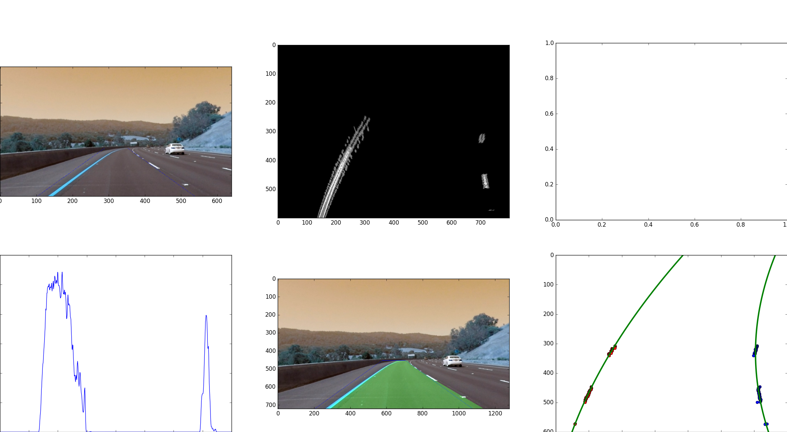

# Advanced-Lane-Lines

Udacity Self-Driving Car Nanodegree project

Submodule from Udacity *CarND-Advanced-Lane-Lines* is part of this repository.
No files are modified.

Scripts:
- calib.py - Camera calibration
- detect.py - script implementing detection pipeline

## Camera calibration

Camera calibration is done in *calib.py*. Script loads every image that match following pattern: `CarND-Advanced-Lane-Lines/camera_cal/*.jpg`.

Termination criteria are defined as follows.
```
# termination criteria
criteria = (cv2.TERM_CRITERIA_EPS + cv2.TERM_CRITERIA_MAX_ITER, 30, 0.001)
```

6x9 board is used. Here are prepared 3D reference coordinates and arrays to store data.
```
# prepare object points, like (0,0,0), (1,0,0), (2,0,0) ....,(6,5,0)
objp = np.zeros((6*9,3), np.float32)
objp[:,:2] = np.mgrid[0:9,0:6].T.reshape(-1,2)

# Arrays to store object points and image points from all the images.
objpoints = [] # 3d point in real world space
imgpoints = [] # 2d points in image plane.
```

Images list.
```
images=glob.glob('CarND-Advanced-Lane-Lines/camera_cal/*.jpg')
```

Iterating through the images to find chess boards on each. If found, points are added to arrays and image is shown.

```
for fname in images:
    img = cv2.imread(fname)
    gray = cv2.cvtColor(img,cv2.COLOR_BGR2GRAY)

    # Find the chess board corners
    ret, corners = cv2.findChessboardCorners(gray, (9,6),None)

    # If found, add object points, image points (after refining them)
    if ret == True:
        objpoints.append(objp)

        corners2 = cv2.cornerSubPix(gray,corners,(11,11),(-1,-1),criteria)
        imgpoints.append(corners2)

        # Draw and display the corners
        img = cv2.drawChessboardCorners(img, (9,6), corners2,ret)
        cv2.imshow('img',img)
        cv2.waitKey(500)
```
Time to destroy all windows and do actual calibration.
```
cv2.destroyAllWindows()

ret, mtx, dist, rvecs, tvecs = cv2.calibrateCamera(objpoints, imgpoints, gray.shape[::-1],None,None)
result=dict()
result['ret']=ret
result['matrix']=np.array(mtx).tolist()
result['dist']=np.array(dist).tolist()
result['rvecs']=np.array(rvecs).tolist()
result['tvecs']=np.array(tvecs).tolist()
```

Saving calibration result to file.
```
with open('calib.json', 'w') as f:
    json.dump(result, f, indent=2, sort_keys=True)
```

## Pipeline (test images)



### Distortion correction

### Binarization

### Perspective transform

### Line fitting

### Calculating radius / curvature

### Calculating position

### Result

## Pipeline (video)

## Discussion
