# Advanced-Lane-Lines

Udacity Self-Driving Car Nanodegree project

Submodule from Udacity *CarND-Advanced-Lane-Lines* is part of this repository.
No files are modified.

Scripts:
- calib.py - Camera calibration
- detect.py - script implementing detection pipeline

## Camera calibration

Camera calibration is done in *calib.py*. Script loads every image that match following pattern: `CarND-Advanced-Lane-Lines/camera_cal/*.jpg`.

Termination criteria are defined as follows.
```
# termination criteria
criteria = (cv2.TERM_CRITERIA_EPS + cv2.TERM_CRITERIA_MAX_ITER, 30, 0.001)
```

6x9 board is used. Here are prepared 3D reference coordinates and arrays to store data.
```
# prepare object points, like (0,0,0), (1,0,0), (2,0,0) ....,(6,5,0)
objp = np.zeros((6*9,3), np.float32)
objp[:,:2] = np.mgrid[0:9,0:6].T.reshape(-1,2)

# Arrays to store object points and image points from all the images.
objpoints = [] # 3d point in real world space
imgpoints = [] # 2d points in image plane.
```

Images list.
```
images=glob.glob('CarND-Advanced-Lane-Lines/camera_cal/*.jpg')
```

Iterating through the images to find chess boards on each. If found, points are added to arrays and image is shown.

```
for fname in images:
    img = cv2.imread(fname)
    gray = cv2.cvtColor(img,cv2.COLOR_BGR2GRAY)

    # Find the chess board corners
    ret, corners = cv2.findChessboardCorners(gray, (9,6),None)

    # If found, add object points, image points (after refining them)
    if ret == True:
        objpoints.append(objp)

        corners2 = cv2.cornerSubPix(gray,corners,(11,11),(-1,-1),criteria)
        imgpoints.append(corners2)

        # Draw and display the corners
        img = cv2.drawChessboardCorners(img, (9,6), corners2,ret)
        cv2.imshow('img',img)
        cv2.waitKey(500)
```
Time to destroy all windows and do actual calibration.
```
cv2.destroyAllWindows()

ret, mtx, dist, rvecs, tvecs = cv2.calibrateCamera(objpoints, imgpoints, gray.shape[::-1],None,None)
result=dict()
result['ret']=ret
result['matrix']=np.array(mtx).tolist()
result['dist']=np.array(dist).tolist()
result['rvecs']=np.array(rvecs).tolist()
result['tvecs']=np.array(tvecs).tolist()
```

Saving calibration result to file.
```
with open('calib.json', 'w') as f:
    json.dump(result, f, indent=2, sort_keys=True)
```

## Pipeline (test images)

The pipeline for images or first frame of video is following:
- undistortion
- perspective transform
- binarization
- line fitting
- calculate curvature and position

For videos there is alternative line fitting step. It will be described below in *line fitting* section. Class `LaneDetector` do all the work.

### Distortion correction

Distortion is corrected using OpenCV `cv2.undistort` function with provided camera calibration data. Images before and after distortion correction are shown below.

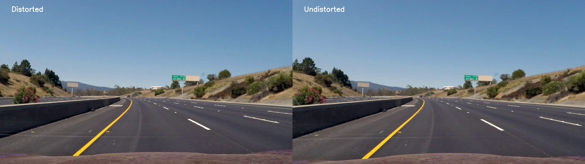

### Perspective transform

Perspective transform is done using `cv2.getPerspectiveTransform` and `cv2.warpPerspective`.
Input points are defined as follows: (top left = `0,0`, bottom right = `1,1`)
* `0.16, 1`
* `0.45, 0.63`
* `0.55, 0.63`
* `0.84, 1`


4 points used to compute transformation matrix.

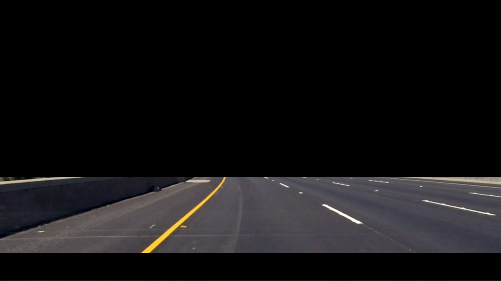
Images are masked above `0.63` and `10%` from bottom

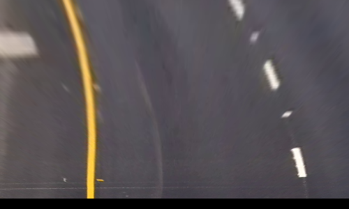
Image transformed to top view using warp perspective.

### Binarization

Binarization is done in following stepd:
1. Blur with 5x5 kernel using `cv2.filter2D`
2. Equalize histogram
  - Convert to YUV colorspace
  - Use `cv2.equalizeHist` with Y channel
  - Convert back to RGB
3. Find white lines
  - Leave only G channel
  - Black all values below 250 and set rest to 255
4. Find yellow lines
  - Apply mask using `cv2.inRange` from `60, 135, 50` to `180, 155, 155`
5. Merge results from 3 and 4

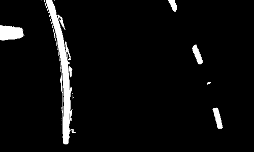

### Line fitting

Line fitting works as follows:
1. Set `center = width/2`
2. For each line in image starting from bottom:
  - Store index of each none zero point in `x_val_hist`
  - If len of `x_val_hist` is greater than 0:
    - Group points to left/right line according to position to `center`
    - If there are points in *left* group:
      - Compute mean
      - Add point
      - Set `center = mean + width*0.2`
    - If there are points in *left* group:
      - Compute mean
      - Add point

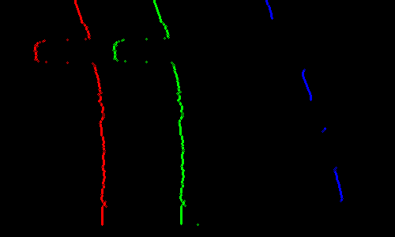

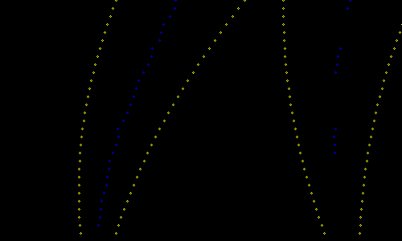

### Calculating radius / curvature

### Calculating position

## Results

### Results on images


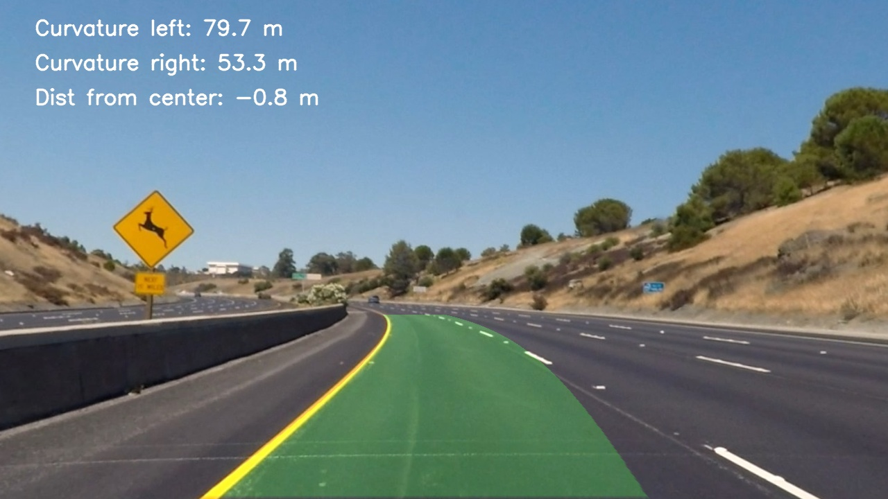

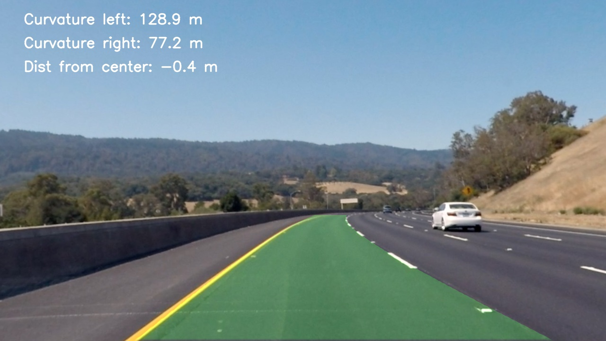

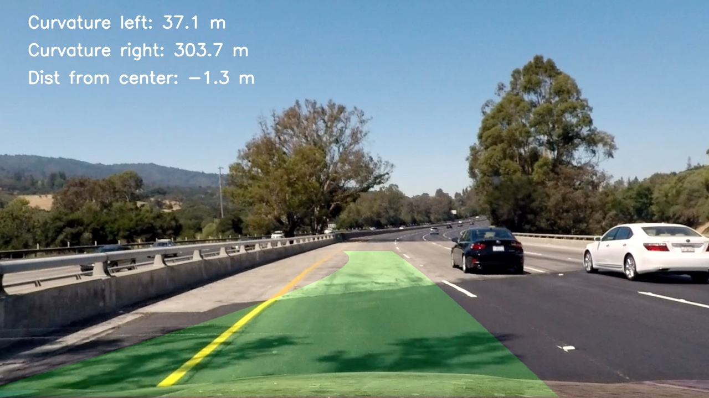

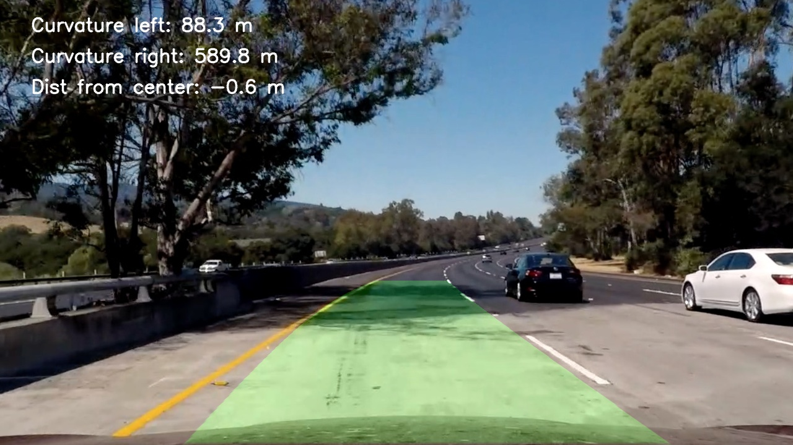

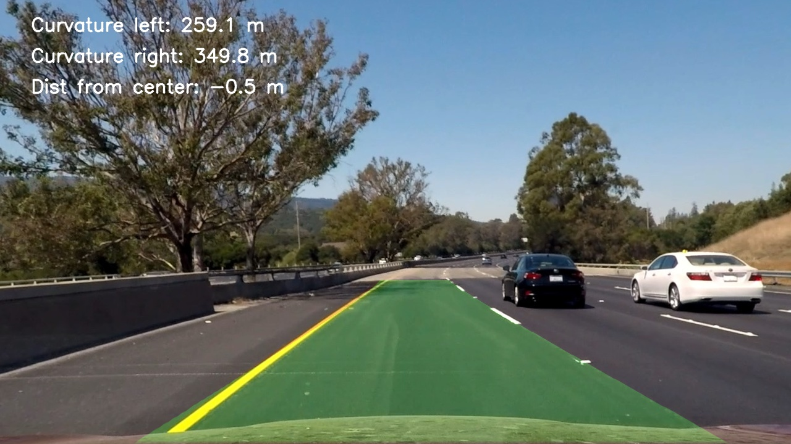


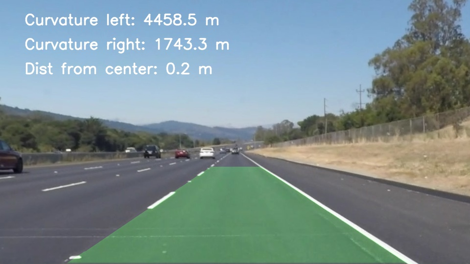

### Results on videos

## Discussion
